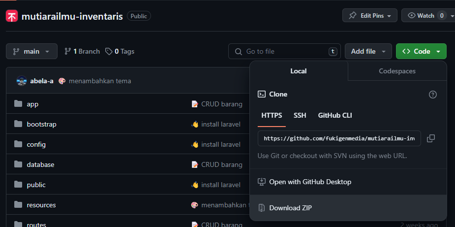

### Cara Install

1. Clone repositori

    - menggunakan git clone

        ```bash
        git clone https://github.com/fukigenmedia/mutiarailmu-inventaris.git
        ```

    - menggunakan download git

        

    > pastikan hasil clone atau downloadnya berada pada folder `xampp/htdocs` atau `laragon/www`

2. Masuk ke folder `mutiarailmu-inventaris` kemudian jalankan install dependensi

    ```bash
    cd mutiarailmu-inventaris
    composer install
    ```

3. Copy file `.env.example` menjadi `.env` dan buat APP_KEY untuk hashing

    ```bash
    cp .env.example .env
    php artisan key:generate
    ```

4. Jalankan migrate dan seeder untuk memasukkan table dan isi defaultnya

    ```bash
    php artisan migrate --seed
    ```

    > Jika tidak dapat melakukan migrate, buat database dengan nama `mutiarailmu_inventaris`. Kemudian migrate ulang.

5. Mulai jalankan aplikasinya
    ```bash
    php artisan serve
    ```
